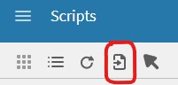
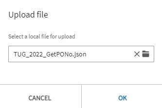
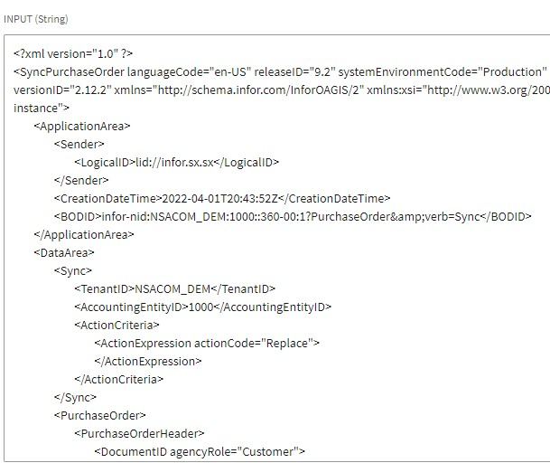
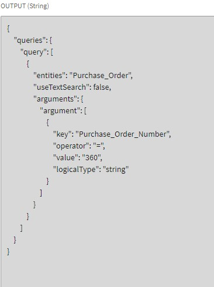

Welcome to the NSA Professional Services GitHub repository.
This script is a sample script that reads a __Sync.PurchaseOrder__ BOD and creates an IDM search item API request in json format.

## Feel free to use and modify the script to suit your needs
***

This is an ION Script that you can import into your own ION desk scripting application.

## Project layout

    docs/
        mkdocs.yml                # The configuration file.
        docs/
            index.md              # The documentation homepage.
            ...                   # Other markdown pages, images and other files.
        createRequest.py          # Python classes to build the IDM API request 
        Sync.PurchaseOrder.xml    # Sample Sync.PurchaseOrder BOD
        TUG_2022_GetPONo.json     # Script that can be imported into ION Desk / Scripting

## Setup

* In ION Desk, go to __Scripting__
* Select Scripts
* Select Import*

* Select __TUG_2022_GetPONo.json__ file

* To test the script in ION Scripting, import the __Sync.PurchaseOrder.xml__ file under the testing tab.

* Select the  button
* Select __YES, SAVE & TEST__
* Preview the results

### The request payload that is generated can be used for an __IDM "Items" POST request.__

__It is valid for the followig endpoints:__

    * /items/count  
    * /items/search  
    * /items/search/item/resource  
    * /items/search/item/resource/stream  
    * /items/search/item/resource/{conversion}  
    * /items/search/item/resource/{conversion}/stream  

Feel free to try it out, change it suit your needs or add it to a project of your own.

